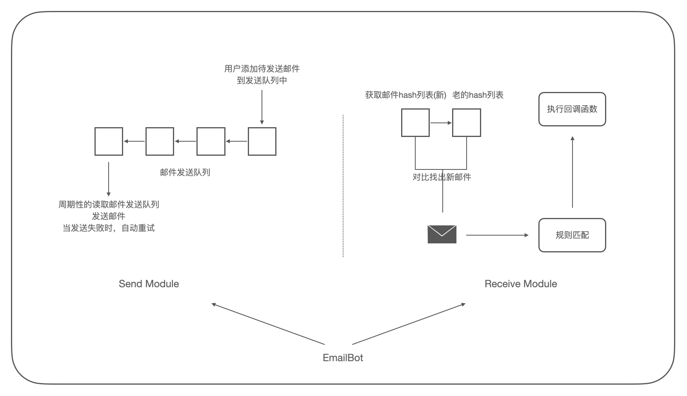

## README.md

### 0x00 前言
`EmailBot` 是一个 Python3 开发的邮件机器人框架/组件库，提供邮件收发功能，并能够根据规则对收到的邮件进行多维度的匹配，执行对应的功能；提供轻量化的服务支持。

日常工作中往往需要提供一些轻量化的服务，比如每日消息推送、固定化的流程审批、对某用户提供定向的数据拉取服务；简单的需求可以用脚本配合邮件推送来完成，比较复杂的需求我们可能会考虑搭建一个 web 服务来完成。

不过这类需求往往算不上一个服务，想在需求和实现之间寻找一个平衡点；起初想使用聊天机器人来搭个框架，不过想到邮箱使用范围更广，所以想用 `EmailBot` 来试试。

### 0x01 Usage
在使用 `EmailBot` 之前，需要首先确认邮箱服务开启了客户端访问(SMTP/POP3/IMAP)，并且需要在邮箱服务里配置客户端密码，这和邮箱账户密码不同，需要手动进行配置获取，用于 `EmailBot` 登录邮箱；

`EmailBot` 可以作为命令行直接启动，或作为第三方库进行集成。

**1.命令行启动**  
`EmailBot` 提供了命令行启动入口，可通过如下方式启动：

```
# python3 emailbot.py -h
usage: emailbot.py [-h] [-u USERNAME] [-p PASSWORD] [--smtp SMTP] [--smtpssl SMTPSSL]
                   [--pop3 POP3] [--pop3ssl POP3SSL] [-v]

EmailBot launch arguments as service

optional arguments:
  -h, --help            show this help message and exit
  -u USERNAME, --username USERNAME
                        the emailbox username
  -p PASSWORD, --password PASSWORD
                        the emailbox password
  --smtp SMTP           SMTP server address(address:port)
  --smtpssl SMTPSSL     connect SMTP server with ssl
  --pop3 POP3           POP3 server address(address:port)
  --pop3ssl POP3SSL     connect POP3 server with ssl
  -v, --version         print emailbot version
```

>如果未设置命令行参数，会尝试加载 `config.py` 中对应的配置，当然也可以将配置直接填写在该文件中。

`EmailBot` 仅是个框架，实际运行前需要配置自己的业务逻辑；在 `interact.py` 中编写规则识别函数和对应的处理逻辑，然后通过 `INTERACTS` 或 `add_rule()` 进行注册：

```
# interact.py
INTERACTS = {
    # work_name: [Rule]
    "debug": rule.Rule(callback_debug_show),
}

# emailbot.py
eb = EmailBot(...)
eb.login(...)
eb.add_rule(callback_debug_show, sender="test@test.com")
eb.run()
```

**2.作为第三方库使用**  
在项目做添加 `EmailBot` 源码作为子目录，在项目中引入即可，如下：

```
emailbot = EmailBot(smtp="smtp.exmail.qq.com" --pop3="pop.exmail.qq.com")
status = emailbot.login(username, password)
if not status:
	return
emailbot.add_rule(callback)
emailbot.run(daemon=True)
```

>当然配置也可以直接写到 `config.py` 中。

可在项目中实现接收到新邮件后的规则匹配，以及最终执行的操作 `callback` 函数，然后通过 `emailbot.add_rule()` 加载，如下：

```
def callback_debug_show(email, regx):
    print("callback_debug_show()")
    print("Email=>")
    print(email)
    print("Regx=>")
    print(regx)
# end callback_func()
```

### 0x02 开发环境

	Ubuntu20.04 x64
	Python3
	
	无第三方依赖


### 0x03 API

**1.Class EmailBot**  

#### `__init__(self, smtp="", pop3="", smtp_port=0, pop3_port=0, smtp_ssl=False, pop3_ssl=False)`

```
@Function: __init__(self, smtp="", pop3="", smtp_port=0, pop3_port=0,
           smtp_ssl=False, pop3_ssl=False)
@Description: the EmailBot object initialize
@Parameter: smtp="", the SMTP server address, using configure if empty
@Parameter: pop3="", the POP3 server address, using configure if empty
@Parameter: smtp_port=0, the SMTP server port, using configure if empty
@Parameter: pop3_port=0, the POP3 server port, using configure if empty
@Parameter: smtp_ssl=False, ssl is required to connect to the SMTP,
            using configure if empty
@Parameter: pop3_ssl=False, ssl is required to connect to the POP3,
            using configure if empty
@Return: None
```

#### `login(self, username="", password="")`
```
@Function: login(self, username="", password="")
@Description: initialize user/pass and server status, and check status
@Parameter: username="", the mailbox username, using configure if empty
@Parameter: password="", the mailbox password, using configure if empty
@Return: status, all server and user/pass is ready
```

#### `add_rule(self, callback, sender="", subject="", content="", func=None)`
```
@Function: add_rule(self, callback, sender="", subject="", content="", func=None)
@Description: add a rule for matching receive new email, when all the rules
  are empty, it means all match.
@Parameter: callback, when the rule is successfully matched, the callback
  function that needs to be executed
@Parameter: sender="", regexp rule which match sender
@Parameter: subject="", regexp rule which match subject
@Parameter: content="", regexp rule which match content
@Parameter: func=None, custom rule match function
@Return: None
```

#### `send_email(self, to, cc="", subject="", content="", attachment="", blocking=False)`
```
@Function: send_email(self, to, cc="", subject="", content="", attachment="", blocking=False)
@Description: the user calls this function to send email.
  if blocking=True, the email will be added to the queue to be sent, the
  email will auto sent and retry.
  if blocking=False, the email will send directly, and return send result
@Parameter: to, the email receiver
@Parameter: cc="", the email carbon copy
@Parameter: subject="", the email subject
@Parameter: content="", the email content
@Parameter: attachment="", the email attachment file path
@Parameter: blocking=False, blocking or not send mode
@Return: None
```

#### `run(self, daemon=False)`
```
@Function: run(self, daemon=False)
@Description: the emailbot launch entrypoint
@Parameter: daemon=False, set background running, facilitate that emailbot
  can be run as a service or be called as a library.
@Return: None
```

**2.rule && callback**  
(可参考源码 `interact.py` 中的示例)  
自定义规则函数接口规范如下：

```
@Function: rule_name(email)
@Description: the rule, xxxx
@Parameter: email, the Email object include email content
@Return: (match, regx), return match result, and return extracted fields as dictionary
```

回调函数接口规范如下：

```
@Function: callback_name(email, regx)
@Description: the callback, xxxx
@Parameter: email, the Email object include email content
@Parameter: regx, the dict that include result matched by rule
@Return: None
```

回调函数添加完毕后，可以直接在该文件下的 `INTERACTS` 中进行注册，或者通过 `add_rule()` 进行注册。


### 0x04 项目结构
`EmailBot` 整体分为两个模块：1.邮件发送模块，2.邮件接收模块；如下：

<div align="center">

</div>

邮件发送模块维护了一个待发送队列，当用户发送邮件时，将邮件加入到该队列中，由模块周期性的扫描并发送邮件，当邮件发送失败时，发送模块将自动重试，直至发送成功。(`EmailBot` 中 `login()` 函数会首先执行服务检查和用户名密码检查，所以在登录成功的情况下，其他的错误如网络故障，服务调整等都认为是可恢复的)

邮件接收模块通过获取邮件列表的 hash 值，来对比是否有新邮件到达，当新邮件达到后，将根据邮件的各项值(如：发件人，邮件名，内容)进行预设的规则匹配，当匹配成功后，调用对应的回调函数，执行具体功能。


### 0x05 源码结构

```
.
├── CHANGELOG
├── Images
├── README.md
├── __init__.py
├── config.py      EmaiBot配置文件
├── emailbot.py    EmailBot主类实现和API
├── interact.py    用户自定义的规则和回调函数
├── mime.py        email类实现以及MIME格式解析
├── protocol.py    邮件协议封装实现
├── rule.py        规则类的实现和匹配执行
└── utils.py       工具函数
```


### 0x06 判断新邮件
`EmailBot` 判断是否接收到新邮件采用了传统邮件客户端的 `hash` 对比方法，也就是通过 `uidl()` 指令获取所有邮件的 hash 值，并比较新老列表就可以判断新邮件。(不能直接用收件箱总数进行判断，删除邮件或设置客户端接收邮件时间范围，都会引起总数的改变)。

>建议使用时设置客户端接收邮件时间范围(如：腾讯企业邮箱默认设置1个月)，目前 `EmailBot` 每次获取全量的邮件 hash 列表，如果收件箱邮件太多，且又没有设置收件时间范围的话，会导致框架执行较慢、造成额外的网络开销。


### 0x07 规则和回调
`EmailBot` 中的规则提供了简易正则模式和自定义模式，添加规则的方式如下：

	add_rule(self, callback, sender="", subject="", content="", func=None)
	
	callback: 规则匹配成功时，需要执行的回调函数
	sender: 正则匹配邮件发送者
	subject: 正则匹配邮件标题
	content: 正则匹配邮件内容
	func: 自定义规则匹配函数

在多个条件之间使用「AND」关系。在规则匹配时，会将匹配内容以 `字典dict` 的方式保存下来，传入到 `callback` 函数中，便于使用。

自定义规则匹配函数应按照如下规范进行编写：

```
@Function: rule_name(email)
@Description: the rule, xxxx
@Parameter: email, the Email object include email content
@Return: (match, regx), return match result, and return extracted fields as dictionary
```
该函数返回值需要返回匹配结果(`bool`)和匹配字典(`dict`)，字典中包含提取的关键词，便于 `callback` 函数直接使用，`EmailBot` 会对所有规则的字典进行合并，如下：

```
{
  "sender": "123456@qq.com",
  "subject": "test",
  "content": "this is test",
  "name": "aaaa",
  "id": 1234
}
```

回调函数接口规范如下，参数为邮件对象和规则函数匹配到的字典：

```
@Function: callback_name(email, regx)
@Description: the callback, xxxx
@Parameter: email, the Email object include email content
@Parameter: regx, the dict that include result matched by rule
@Return: None
```

当规则命中后，`Emailbot` 将启动新的线程执行该回调函数。

### 0x08 issue

1. 不支持附件接收
2. 不支持 IMAP 协议
3. email格式解析不完善，比如：plain 和 html 格式未区分
4. 借助 mutt 来实现邮件自动化可能是更好的方案


</br>

--------------------------------
References:  
<https://www.ietf.org/rfc/rfc1939.txt>  
<https://www.ietf.org/rfc/rfc2060.txt>  
<https://www.ietf.org/rfc/rfc2821.txt>  
<https://docs.python.org/3/library/email.html>  
<https://docs.python.org/3/library/smtplib.html>  
<https://docs.python.org/3/library/poplib.html>  
<https://docs.python.org/3/library/imaplib.html>  
<https://github.com/python/cpython/blob/3.9/Lib/poplib.py>  
<https://github.com/python/cpython/blob/3.9/Lib/smtplib.py>  
<https://en.wikipedia.org/wiki/MIME>  
<https://www.dev2qa.com/python-parse-emails-and-attachments-from-pop3-server-example/>  
